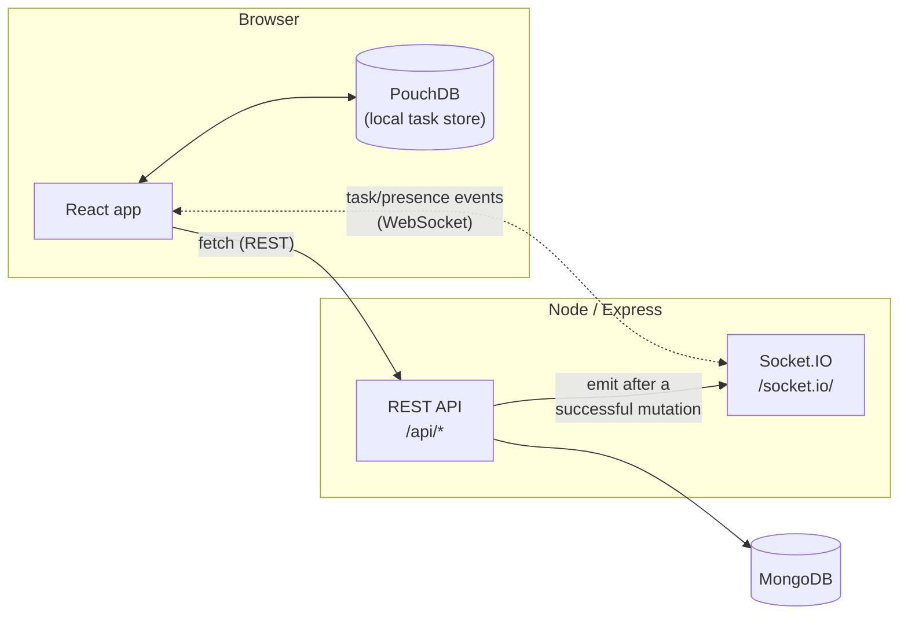

# Flowty

A kanban-style task board with real board ownership, member invitations,
and permissioned tasks. Full-stack: React client + Express API + MongoDB.

## Structure

```
frontend/   React + Vite client (see frontend/README.md)
backend/    Express API (see backend/README.md)
docs/       API_CONTRACT.md, SOCKET_EVENTS.md, DECISIONS.md
Postman/    Flowty.postman_collection.json — every endpoint, success + failure cases
```

## Architecture



Express and Socket.IO share **one** HTTP server (`backend/src/server.js`),
not two separate ports — this is also what makes a single reverse-proxy
rule handle both `/api/*` and `/socket.io/*` in Docker/production. Every
task mutation still goes through the REST API and its full permission +
optimistic-concurrency checks exactly once; Socket.IO only broadcasts the
result to everyone else already looking at that board. See
`docs/SOCKET_EVENTS.md` for the full event contract and
`docs/DECISIONS.md` for why it's built this way.

## Running both

```bash
# Terminal 1 — backend
cd backend
cp .env.example .env   # fill in JWT_SECRET (any random string) and MONGODB_URI
npm install
npm run dev              # http://localhost:4000

# Terminal 2 — frontend
cd frontend
npm install
npm run dev               # http://localhost:5173
```

Then open `http://localhost:5173` and register a new account at `/signup` —
there's no seeded login; every account and board is created for real
through the API.

## Core concepts

- **Boards have exactly one owner and any number of members.** The owner
  creates and assigns tasks, edits the board, and manages membership.
  Members can only move the cards assigned to them between columns —
  they can't create, edit, reassign, or delete tasks.
- **Joining a board goes through an invitation, not a direct add.** A
  board owner sends an invite by email (or by searching the Team page);
  the invited person sees it as a notification (the bell icon in the top
  bar) and has to Accept before they're actually added to the board.
- **Every board/task list is scoped to the logged-in user.** `GET
  /api/boards` and `GET /api/tasks` only ever return boards/tasks the
  user owns or is a member of — never the whole database.
- **Task changes are real-time.** Create, move, or delete a task and
  everyone else currently looking at that board sees it immediately, no
  refresh needed — a Socket.IO connection pushes the same object the REST
  API would've returned to it, scoped to that board's room only. See
  `docs/SOCKET_EVENTS.md` for the event contract, and the "● N online"
  indicator on a board's header for presence.

## API

Full request/response contract, including every error case:
`docs/API_CONTRACT.md`.
Real-time (Socket.IO) event contract: `docs/SOCKET_EVENTS.md`.
Importable Postman collection: `Postman/Flowty.postman_collection.json`
(REST only — Postman doesn't exercise the socket layer, see
`docs/SOCKET_EVENTS.md` for how to test that by hand).

| Resource | Base path | Auth required |
|---|---|:---:|
| Auth | `/api/auth/*` | Only `/me` |
| Tasks | `/api/tasks` | Yes |
| Boards | `/api/boards` (+ `/members`, `/invitations`, `/stats`) | Yes |
| Invitations | `/api/invitations` | Yes |
| Users | `/api/users` (supports `?q=` search) | Yes |
| Activity | `/api/activity` | Yes |

## Status

- [x] Front-end: all pages built, wired to the real API — no mock data remains
- [x] Backend: Express API layered (routes/controllers/services/repositories)
- [x] MongoDB persistence (Mongoose) for users, boards, tasks, invitations
- [x] Auth: register, login, JWT, protected `/me`
- [x] Board ownership + membership model, with owner-only task
      creation/editing and assignee-only card moves enforced server-side
- [x] Invitation flow: send → pending → notification → accept/decline
- [x] Team page: board-scoped member list, search-to-invite by name/email
- [x] Task creation via a modal (title, description, status, assignee,
      due date + time) with a custom calendar/time picker
- [x] Offline-first task sync (PouchDB) with conflict detection
- [x] Postman collection covering every endpoint, including permission
      and failure cases (see `Postman/` above)
- [x] Automated tests + CI (Jest/Supertest on the backend, Vitest/RTL on
      the frontend — GitHub Actions runs both on every push/PR)
- [x] Real-time task sync (Socket.IO): live create/move/delete across
      everyone viewing a board, plus a presence indicator. The
      invitation bell still polls — see `docs/SOCKET_EVENTS.md`'s "Not
      implemented" section for why that's a deliberate scope cut, not a
      gap
- [ ] Docker, deployment
