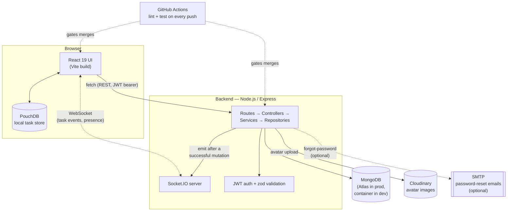

# Tech Stack

What's actually in this codebase, what each piece is for, and — just as
importantly for explaining the project — what was deliberately left out
and why. Every item below is pulled directly from `package.json`, not
from memory, so this reflects what's really installed and imported, not
a list of what a project like this typically uses.

## Architecture

Two deploy shapes exist for this same diagram — see `docs/DEPLOYMENT.md`
and `docs/DECISIONS.md` for why they differ:
- **Local (Docker Compose):** frontend served through nginx, same-origin,
  proxying `/api` and `/socket.io` to the backend container internally.
- **Production (Render):** frontend as a static site talking to the
  backend's public URL directly, cross-origin, CORS-scoped.

## What we use

### Frontend
| Package | What it's for |
|---|---|
| `react` / `react-dom` | UI. React 19 — no Redux, no separate state library; see "What we don't use" below for why. |
| `react-router-dom` | Client-side routing — board pages, auth pages, settings, etc. |
| `pouchdb-browser` | Local-first task store. Every task write lands here first; a background sync loop pushes it to the API. This is what makes the app usable offline and what real-time socket events write into (see `docs/SOCKET_EVENTS.md`). |
| `socket.io-client` | The real-time connection — task events and presence, layered on top of PouchDB rather than replacing it. |
| `framer-motion` | Animation (page transitions, modals, drag interactions). |
| `lucide-react` | Icon set — consistent icons without hand-drawn SVGs per icon. |
| `events` | A small polyfill so `pouchdb-browser` (written for Node) has an `EventEmitter` to use in the browser — not something app code calls directly. |

**Dev/test only:** `vite` (build tool/dev server), `vitest` + `@testing-library/react` + `@testing-library/jest-dom` + `@testing-library/user-event` (component tests), `jsdom` (fake DOM for tests to run in Node), `msw` (mocks API responses in tests instead of hitting a real server), `eslint` + plugins (linting, including React-Hooks-specific rules).

### Backend
| Package | What it's for |
|---|---|
| `express` | The HTTP framework — routes, middleware, everything REST. |
| `socket.io` | The real-time layer, attached to the same HTTP server Express uses (see `docs/SOCKET_EVENTS.md`). |
| `mongoose` | MongoDB object modeling — schemas for User, Board, Task, Invitation, Activity, plus the query layer. |
| `jsonwebtoken` | Issues and verifies the JWTs used for both REST auth and the socket handshake. |
| `bcryptjs` | Password hashing. Pure-JS (not `bcrypt`'s native bindings) specifically so it doesn't need a C++ build step — one less thing to break across different machines/Docker base images. |
| `zod` | Request-body validation schemas — one per resource, checked before a controller ever sees the data. |
| `cors` | CORS middleware — scoped to a single configured origin (`CLIENT_ORIGIN`), not a wildcard. |
| `multer` + `cloudinary` | Avatar upload: `multer` parses the multipart form data in memory, `cloudinary` streams it to Cloudinary's CDN with a face-crop transformation applied server-side. |
| `nodemailer` | Sends the forgot-password email — optional, see `docs/DEPLOYMENT.md`; without SMTP configured it logs what would've been sent instead. |
| `node-cron` | Schedules the weekly summary email job. |
| `dotenv` | Loads `.env` in local dev. A no-op in Docker/Render, where env vars are injected directly by the platform instead. |

**Dev/test only:** `jest` + `supertest` (API tests — supertest calls the Express app directly, no server needs to be listening), `mongodb-memory-server` (spins up a real, throwaway MongoDB for tests — not mocked, an actual in-memory instance), `socket.io-client` (the socket integration test connects with a real client, same package the frontend uses), `eslint`.

### Infrastructure
| Tool | What it's for |
|---|---|
| Docker | `backend/Dockerfile` (single-stage, `node:22-alpine`) and `frontend/Dockerfile` (multi-stage: Vite build → `nginx:alpine` serve). |
| Docker Compose | Local orchestration — Mongo + backend + frontend-via-nginx, wired with healthchecks. |
| nginx | Serves the built frontend and reverse-proxies `/api` and `/socket.io` to the backend, in the *local* Docker setup only — the production static-site deploy doesn't use it. |
| MongoDB Atlas | The production database — a real managed cluster, not a container, free M0 tier. |
| Render | Hosting — backend as a Docker web service, frontend as a static site. |
| GitHub Actions | CI — lints and tests both halves on every push/PR (`actions/checkout@v5`, `actions/setup-node@v5` on Node 22, with dependency caching). |
| Postman | The API test collection in `Postman/` — every endpoint, success and failure cases, kept separate from the automated test suite. |

## What we deliberately don't use

Naming these — and why — is worth having ready, since "why didn't you
use X" is a common question once a marker sees the stack, and "we didn't
think of it" reads very differently from "we considered it and here's
the tradeoff."

| Not used | Why not |
|---|---|
| **Redux / Zustand / another state library** | React's built-in Context + `useState`/`useReducer` was enough for this app's actual state shape — a handful of contexts (`AuthContext`, `TasksContext`, `BoardsContext`, `SocketContext`, etc.), each owning one clear slice. Redux's ceremony (actions, reducers, a store) buys you very little at this scale and would've added a dependency and a learning curve for no real gain. |
| **GraphQL** | The data-fetching patterns here are simple, resource-shaped REST calls (`GET /api/boards`, `POST /api/tasks`) — there's no deeply nested, client-driven query shape that GraphQL earns its complexity solving. REST also made the Postman collection and `docs/API_CONTRACT.md` straightforward in a way a single GraphQL endpoint wouldn't have been. |
| **TypeScript** | A real tradeoff, not a dismissal — TS would have caught some classes of bugs earlier. Went with plain JS + `zod` schemas at the API boundary (which *does* give runtime type safety, just not compile-time) to keep the whole team's ramp-up faster within the course timeline. Worth naming as a genuine "if we did this again" candidate. |
| **Kubernetes** | Massive overkill for a two-service app at this scale. Docker Compose locally, two independent Render services in production — see `docs/DECISIONS.md` for why those two shapes differ. K8s would add an entire orchestration layer to learn and operate for zero benefit until this needed multi-instance scaling, which it doesn't. |
| **Redis** | The one place it would matter — Socket.IO presence/room state — is explicitly scoped to a single instance for now (see `docs/SOCKET_EVENTS.md`'s "Not implemented" section). The Socket.IO Redis adapter is a known, documented drop-in for *if* this ever needs more than one backend instance; not worth adding before that's true. |
| **A native `bcrypt`** | Chose `bcryptjs` (pure JavaScript) specifically to avoid a native-module build step — one less way for `npm install` to fail differently on a teammate's machine, in CI, or inside the Alpine-based Docker image than it does locally. |
| **Server-rendering (Next.js, etc.)** | This is an authenticated, behind-a-login task board, not a content site — there's no SEO or first-paint case that server rendering would help with, and it would've meant a heavier framework for a Vite SPA that already loads fast. |
| **A second database / ORM** | One MongoDB instance via Mongoose covers every entity — no separate cache store, no relational database alongside it. Nothing in this domain (boards, tasks, users) needed relational joins badly enough to justify running two databases. |
| **Microservices** | One backend process. Splitting auth, tasks, and notifications into separate deployable services would multiply the deployment and inter-service-communication surface for an app with one small team and no independent scaling needs between those pieces. |
